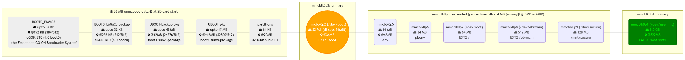

# Imaging the PocketBook InkPad 3 (740) and misc notes

## Step 1: Root device
See https://www.mobileread.com/forums/showthread.php?t=325185 and its associated code repository https://github.com/ezdiy/pbjb

## Step 2: Dump device to external SD
Required space is around 1.5GB once compressed, more if the internal storage was modified (added books, dictionaries, TTS voices, etc.).

Once inserted, the external SD is automatically mounted at `/mnt/ext2/`

```shell
# dd bs=1M if=/dev/mmcblk0 | gzip -c | split -b 4095m - /mnt/ext2/mmcblk0--dd.gz. &
# watch -n5 'kill -USR1 $(pgrep ^dd)'
```

Since the InkPad 3 uses a FAT32 filesystem for the SD, size is limited to 4GB per file. You may opt to dump the device with no compression (because the embedded SoC, Allwinner B288, is a very slow dual-core ARM CPU) but retain the split part: remove the ` | gzip -c` part.

Hit `Ctrl+C` when the dd program ends and there is no process to monitor.

## Misc.

### Device-specific data
- /sys/block/mmcblk0/device/cid
- /sys/block/mmcblk0/device/csd

Historically on devices booting on the hidden internal SD (PocketBook 626), they would bootloop when swapping the original SD for a cloned larger one, because of a check in **monitor.app**. See https://www.mobileread.com/forums/showthread.php?t=278728

### Mounts / partitioning

`$ mount`
rootfs on / (rootfs)
dev/root on / (ext2)
/dev/mmcblk0p2 on /boot (ext2)
/dev/ebrmain on /ebrmain (ext2)
/dev/secure on /secure (ext2)
/dev/loop0 on /ebrmain/cramfs (cramfs)
/dev/user_int on /mnt/ext1 (vfat)
/dev/user_extp1 on /mnt/ext2 (vfat)

`$ cat /etc/fstab`
none                    /proc             proc    defaults  0 0
none                    /dev/pts          devpts  mode=0622 0 0
tmpfs                   /dev/shm          tmpfs   defaults  0 0
/dev/ebrmain          /ebrmain          auto    ro        0 0
/dev/secure          /mnt/secure       auto    defaults  0 0
/ebrmain/cramfs.img     /ebrmain/cramfs   auto    defaults,loop 0 0
/dev/mmcblk0p2          /boot           auto    ro 0 0

---------------------------------------------------

**fstab from swupdate**  (Extracted from `SWUPDATE.BIN` with the "SynkActiv" script):
```
none			/proc		proc	  defaults  0 0
none			/dev/pts	devpts  mode=0622 0 0
tmpfs			/dev/shm	tmpfs	  defaults  0 0
/dev/ebrmain		/ebrmain	auto    ro        0 0
/dev/secure		/mnt/secure	auto    defaults  0 0
/ebrmain/cramfs.img	/ebrmain/cramfs	auto	defaults,loop 0 0
/dev/bootfs		/boot		auto	ro 	0 0
```

fdisk -l: blank response

### Filled with 00-bytes: mmcblk0boot0 and mmcblk0boot1
```
# dd if=/dev/mmcblk0boot0 of=/mnt/ext2/backup/mmcblk0boot0.dd
# dd if=/dev/mmcblk0boot1 of=/mnt/ext2/backup/mmcblk0boot1.dd
```

### Exploring the partitioning with root
`cat /proc/partitions`

|major | minor | #blocks | name |
|--|--|--|-- |
|7 | 0 | 120004 | loop0 |
|179 | 0 | 7634944 | mmcblk0 |
|179 | 1 | 6793216 | mmcblk0p1 |
|179 | 2 | 32768 | mmcblk0p2 |
|179 | 3 | 1 | mmcblk0p3 |
|179 | 5 | 16384 | mmcblk0p5 |
|179 | 6 | 34816 | mmcblk0p6 |
|179 | 7 | 65536 | mmcblk0p7 |
|179 | 8 | 524288 | mmcblk0p8 |
|179 | 9 | 131072 | mmcblk0p9 |
|179 | 224 | 4096 | mmcblk0boot1 |
|179 | 208 | 4096 | mmcblk0boot0 |
|179 | 16 | 61897728 | mmcblk1 |
|179 | 17 | 61896704 | mmcblk1p1 |

Notice how the block count seems off for mmcblk0p3

`# fdisk -l`
Disk /dev/mmcblk0: 7456 MB, 7818182656 bytes, 15269888 sectors
954368 cylinders, 1 heads, 16 sectors/track
Units: cylinders of 16 * 512 = 8192 bytes

|Device |Boot |StartCHS |EndCHS |StartLBA |EndLBA |Sectors |Size |Id |Type|
|-|-|-|-|-|-|-|-|-|-|
|/dev/mmcblk0p1 |* |0,0,0 |0,0,0 |1683456 |15368191 |13684736 |6682M |b |Win95 |FAT32|
|Partition 1 does not end on cylinder boundary|
|/dev/mmcblk0p2 | |0,0,0 |0,0,0 |73728 |139263 |65536 |32.0M |6 |FAT16|
Partition 2 does not end on cylinder boundary|
|/dev/mmcblk0p3 | |0,0,0 |0,0,0 |1 |1544192 |1544192 |754M |5 |Extended|
Partition 3 does not end on cylinder boundary|
|/dev/mmcblk0p5 | |0,0,0 |0,0,0 |139264 |172031 |32768 |16.0M |83 |Linux|
|/dev/mmcblk0p6 | |0,0,0 |0,0,0 |172032 |241663 |69632 |34.0M |83 |Linux|
|/dev/mmcblk0p7 | |0,0,0 |0,0,0 |241664 |372735 |131072 |64.0M |83 |Linux|
|/dev/mmcblk0p8 | |0,0,0 |0,0,0 |372736 |1421311 |1048576 |512M |83 |Linux|
|/dev/mmcblk0p9 | |0,0,0 |0,0,0 |1421312 |1683455 |262144 |128M |83 |Linux|

```
Partition table entries are not in disk order
Disk /dev/mmcblk0boot1: 4 MB, 4194304 bytes, 8192 sectors
128 cylinders, 4 heads, 16 sectors/track
Units: cylinders of 64 * 512 = 32768 bytes

Disk /dev/mmcblk0boot1 doesn't contain a valid partition table
Disk /dev/mmcblk0boot0: 4 MB, 4194304 bytes, 8192 sectors
128 cylinders, 4 heads, 16 sectors/track
Units: cylinders of 64 * 512 = 32768 bytes

Disk /dev/mmcblk0boot0 doesn't contain a valid partition table
```

### Detecting supported file systems
```bash
# blkid /dev/mmcblk0p*
/dev/mmcblk0p1: LABEL="Vivlio" UUID="4B3D-7544"
/dev/mmcblk0p2: LABEL="Volumn"
/dev/mmcblk0p7: UUID="da0bb0fb-8c84-477c-b781-1f8c7b6c5016"
/dev/mmcblk0p8: UUID="04ce3511-5916-48d5-99be-c57f0bc955f1"
/dev/mmcblk0p9: UUID="e3f04df8-c1d9-4de3-8640-b40d3a2ee37e"
```

`# df -h`

| Filesystem | Size | Used | Available | Use% | Mounted | on |
| - | - | - | - | - | - | - |
| /dev/root | 63.6M | 19.8M | 40.6M | 33% | / |
| none | 128.0M | 504.0K | 127.5M | 0% | /var |
| /dev/mmcblk0p2 | 63.9M | 12.8M | 51.0M | 20% | /boot |
| tmpfs | 498.1M | 4.0K | 498.1M | 0% | /var/dev/shm |
| /dev/ebrmain | 507.7M | 301.0M | 181.1M | 62% | /ebrmain |
| /dev/secure | 124.0M | 41.6M | 76.0M | 35% | /mnt/secure |
| /dev/loop0 | 220.6M | 220.6M | 0 | 100% | /ebrmain/cramfs |
| /dev/user_int | 6.5G | 1.1G | 5.4G | 17% | /mnt/ext1 |
| /dev/user_extp1 | 59.0G | 1.2G | 57.8G | 2% | /mnt/ext2 |
| /dev/secure | 124.0M | 41.6M | 76.0M | 35% | /ebrmain/cramfs/bin/netagent |
| /dev/secure | 124.0M | 41.6M | 76.0M | 35% | /lib/modules/ins_usb_mod.sh |
| /dev/secure | 124.0M | 41.6M | 76.0M | 35% | /lib/modules/rm_usb_mod.sh |
| /dev/secure | 124.0M | 41.6M | 76.0M | 35% | /lib/modules/ins_usbnet.sh |
| /dev/secure | 124.0M | 41.6M | 76.0M | 35% | /lib/modules/rm_usbnet.sh |

Note the dev/secure mounts are added by the jailbreak kit.

```bash
# find /var/dev -type l -exec ls -al {} ';'
lrwxrwxrwx    1 root     root             6 Dec  1 23:19 /var/dev/input/keyboard0 -> event0
lrwxrwxrwx    1 root     100              9 Dec  1 23:19 /var/dev/secure -> mmcblk0p9
lrwxrwxrwx    1 root     100              3 Dec  1 23:19 /var/dev/fb -> fb0
lrwxrwxrwx    1 root     100              4 Dec  1 23:19 /var/dev/pvi_io -> zero
lrwxrwxrwx    1 root     100              4 Dec  1 23:19 /var/dev/rtc -> rtc0
lrwxrwxrwx    1 root     100              9 Dec  1 23:19 /var/dev/rootfs -> mmcblk0p7
lrwxrwxrwx    1 root     root             7 Dec  1 23:19 /var/dev/misc/rtc -> ../rtc0
lrwxrwxrwx    1 root     100              9 Dec  1 23:19 /var/dev/ebrmain -> mmcblk0p8
lrwxrwxrwx    1 root     100              9 Dec  1 23:19 /var/dev/user_int -> mmcblk0p1
lrwxrwxrwx    1 root     100              4 Dec  1 23:19 /var/dev/pvi_ioc -> zero
lrwxrwxrwx    1 root     100              7 Dec  1 23:19 /var/dev/user_ext -> mmcblk1
lrwxrwxrwx    1 root     100              3 Dec  1 23:19 /var/dev/einkdrv -> fb0
lrwxrwxrwx    1 root     100              7 Dec  1 23:19 /var/dev/mxc_mem -> mxc_iim
lrwxrwxrwx    1 root     100              9 Dec  1 23:19 /var/dev/user_extp1 -> mmcblk1p1
lrwxrwxrwx    1 root     100              9 Dec  1 23:19 /var/dev/root -> mmcblk0p7

```

See https://linux-sunxi.org/PocketBook_Touch_Lux_2_(626)#Device_specific_topic for a similar layout
Here we have A20-style NAND layout at 0x01400000
See https://github.com/linux-sunxi/sunxi-tools/blob/master/nand-part-a20.h

(all offsets below need to add 0x01400000 = 20 MB)

### Parsing the sunxi partition table at offset 20 MB
```bash
nandmbr-parse$ ./a.out SUNXIMBR.bin
SUNXIMBR.bin
check partition table
mbr: version 0x00000200, magic softw411
7 partitions
partition  1: class =         DISK, name =       bootfs, partition start =    32768, partition size =    65536 user_type=32768
partition  2: class =         DISK, name =          env, partition start =    98304, partition size =    32768 user_type=32768
partition  3: class =         DISK, name =        pbenv, partition start =   131072, partition size =    69632 user_type=32768
partition  4: class =         DISK, name =       rootfs, partition start =   200704, partition size =   131072 user_type=32768
partition  5: class =         DISK, name =      ebrmain, partition start =   331776, partition size =  1048576 user_type=32768
partition  6: class =         DISK, name =       secure, partition start =  1380352, partition size =   262144 user_type=32768
partition  7: class =         DISK, name =        UDISK, partition start =  1642496, partition size =        0 user_type=33024
```
```bash
nandmbr-parse$ ./a.out SUNXIMBR2.bin
SUNXIMBR2.bin
check partition table
mbr: version 0x00000200, magic softw411
7 partitions
partition  1: class =         DISK, name =       bootfs, partition start =    32768, partition size =    65536 user_type=32768
partition  2: class =         DISK, name =          env, partition start =    98304, partition size =    32768 user_type=32768
partition  3: class =         DISK, name =        pbenv, partition start =   131072, partition size =    69632 user_type=32768
partition  4: class =         DISK, name =       rootfs, partition start =   200704, partition size =   131072 user_type=32768
partition  5: class =         DISK, name =      ebrmain, partition start =   331776, partition size =  1048576 user_type=32768
partition  6: class =         DISK, name =       secure, partition start =  1380352, partition size =   262144 user_type=32768
partition  7: class =         DISK, name =        UDISK, partition start =  1642496, partition size =        0 user_type=33024
```

```bash
nandmbr-parse$ ./a.out SUNXIMBR3.bin
SUNXIMBR3.bin
check partition table
mbr: version 0x00000200, magic softw411
7 partitions
partition  1: class =         DISK, name =       bootfs, partition start =    32768, partition size =    65536 user_type=32768
partition  2: class =         DISK, name =          env, partition start =    98304, partition size =    32768 user_type=32768
partition  3: class =         DISK, name =        pbenv, partition start =   131072, partition size =    69632 user_type=32768
partition  4: class =         DISK, name =       rootfs, partition start =   200704, partition size =   131072 user_type=32768
partition  5: class =         DISK, name =      ebrmain, partition start =   331776, partition size =  1048576 user_type=32768
partition  6: class =         DISK, name =       secure, partition start =  1380352, partition size =   262144 user_type=32768
partition  7: class =         DISK, name =        UDISK, partition start =  1642496, partition size =        0 user_type=33024
```

```bash
nandmbr-parse$ ./a.out SUNXIMBR4.bin
SUNXIMBR4.bin
check partition table
mbr: version 0x00000200, magic softw411
7 partitions
partition  1: class =         DISK, name =       bootfs, partition start =    32768, partition size =    65536 user_type=32768
partition  2: class =         DISK, name =          env, partition start =    98304, partition size =    32768 user_type=32768
partition  3: class =         DISK, name =        pbenv, partition start =   131072, partition size =    69632 user_type=32768
partition  4: class =         DISK, name =       rootfs, partition start =   200704, partition size =   131072 user_type=32768
partition  5: class =         DISK, name =      ebrmain, partition start =   331776, partition size =  1048576 user_type=32768
partition  6: class =         DISK, name =       secure, partition start =  1380352, partition size =   262144 user_type=32768
partition  7: class =         DISK, name =        UDISK, partition start =  1642496, partition size =        0 user_type=33024
```

# Mermaid graph


[View](https://mermaid-js.github.io/mermaid-live-editor/#/edit/eyJjb2RlIjoiZ3JhcGggTFJcblxuJSVkZWZpbmUgY2xhc3Nlc1xuY2xhc3NEZWYgY2xhc3NPayBmaWxsOmdyZWVuLGNvbG9yOiMwMEZGMDAsc3Ryb2tlLXdpZHRoOjJweCxzdHJva2U6ZGFya0dyZWVuO1xuY2xhc3NEZWYgY2xhc3NXYXJuIGZpbGw6b3JhbmdlLGNvbG9yOiNGRkYsc3Ryb2tlLXdpZHRoOjJweCxzdHJva2U6ZGFya09yYW5nZTtcbmNsYXNzRGVmIGNsYXNzRGlzIGZpbGw6I2VlZSxjb2xvcjojMDAwLHN0cm9rZS13aWR0aDowO1xuJSVjbGFzc0RlZiBub2RlIHN0cm9rZTojMDAwMGZmLHN0cm9rZS13aWR0aDo0cHg7XG5cbnN1YmdyYXBoIHVubWFwcGVkW1wiZmE6ZmEtbWljcm9jaGlwIDM2IE1CIHVubWFwcGVkIGRhdGEgZmE6ZmEtcXVlc3Rpb24tY2lyY2xlIGF0IFNEIGNhcmQgc3RhcnRcIl1cbmVnb24wLTEoXCJCT09UMF9FTU1DMzxici8+ZmE6ZmEtaGRkIHVwdG8gMzIgS0I8YnIvPmZhOmZhLW1hcC1tYXJrZXItYWx0IEAxOTIgS0IgKDM4NCo1MTIpPGJyLz5lR09OLkJUMCAoNC4wIGJvb3QwKTxici8+J3RoZSBFbWJlZGRlZCBHTy1PTiBCb290bG9hZGVyIFN5c3RlbSdcIilcbi0tLVxuXG5lZ29uMC0yKFwiQk9PVDBfRU1NQzMgYmFja3VwPGJyLz5mYTpmYS1oZGQgdXB0byAzMiBLQjxici8+ZmE6ZmEtbWFwLW1hcmtlci1hbHQgQDI1NiBLQiAoNTEyKjUxMik8YnIvPmVHT04uQlQwICg0LjAgYm9vdDApXCIpXG4tLS1cblxudWJvb3R0b2MtYmFja3VwKFwiVUJPT1QtYmFja3VwIHBrZzxici8+ZmE6ZmEtaGRkIHVwdG8gND8gTUI8YnIvPmZhOmZhLW1hcC1tYXJrZXItYWx0IEAxMk1CICgyNDU3Nio1MTIpPGJyLz5ib290MSBzdW54aS1wYWNrYWdlXCIpXG4tLS1cblxudWJvb3R0b2MtbWFpbihcIlVCT09UIHBrZzxici8+ZmE6ZmEtaGRkIHVwdG8gND8gTUI8YnIvPmZhOmZhLW1hcC1tYXJrZXItYWx0IEB+MTZNQiAoMzI4MDAqNTEyKTxici8+Ym9vdDEgc3VueGktcGFja2FnZVwiKVxuLS0tXG5cbnBhcnR0YWJsZShcInBhcnRpdGlvbnM8YnIvPmZhOmZhLWhkZCA2NCBLQjxici8+ZmE6ZmEtbWFwLW1hcmtlci1hbHQgQDIwTUI8YnIvPjR4IDE2S0Igc3VueGkgUFRcIilcbmVuZFxucGFydHRhYmxlIC0tLSBtbWNibGswcDJcblxuc3ViZ3JhcGggXCJtbWNibGswcDI6IHByaW1hcnk8YnIvPlwiXG5tbWNibGswcDIoKFwibW1jYmxrMHAyICgvZGV2L2Jvb3QpPGJyLz5mYTpmYS1oZGQgMzIgTUIgW2RmIHNheXMgNjRNQj9dPGJyLz5mYTpmYS1tYXAtbWFya2VyLWFsdCBAMzZNQjxici8+RkFUMTYgL2Jvb3RcIikpXG5lbmRcbm1tY2JsazBwMiAtLS0gbW1jYmxrMHA1XG5cbnN1YmdyYXBoIFwibW1jYmxrMHAzOiBleHRlbmRlZCBbcHJvdGVjdGl2ZT9dIGZhOmZhLWhkZCA3NTQgTUIgKHdyb25nIGZhOmZhLW1hcC1tYXJrZXItYWx0IEAuNU1CIGluIE1CUilcIlxubW1jYmxrMHA1KFwibW1jYmxrMHA1PGJyLz5mYTpmYS1oZGQgMTYgTUI8YnIvPmZhOmZhLW1hcC1tYXJrZXItYWx0IEA2OE1CPGJyLz5lbnZcIilcbi0tLVxuXG5tbWNibGswcDYoXCJtbWNibGswcDY8YnIvPmZhOmZhLWhkZCAzNCBNQjxici8+cGJlbnZcIilcbi0tLVxuXG5tbWNibGswcDcoXCJtbWNibGswcDcgKC9kZXYvcm9vdCk8YnIvPmZhOmZhLWhkZCA2NCBNQjxici8+RVhUMiAvXCIpXG4tLS1cblxubW1jYmxrMHA4KFwibW1jYmxrMHA4ICgvZGV2L2Vicm1haW4pPGJyLz5mYTpmYS1oZGQgNTEyIE1CPGJyLz5FWFQyIC9lYnJtYWluXCIpXG4tLS1cblxubW1jYmxrMHA5KFwibW1jYmxrMHA5ICgvZGV2L3NlY3VyZSk8YnIvPmZhOmZhLWhkZCAxMjggTUI8YnIvPiAvbW50L3NlY3VyZVwiKVxuZW5kXG5tbWNibGswcDkgLS0tIG1tY2JsazBwMVxuXG5zdWJncmFwaCBcIm1tY2JsazBwMTogcHJpbWFyeVwiXG5tbWNibGswcDEoXCJtbWNibGswcDEgKC9kZXYvdXNlcl9pbnQpPGJyLz5mYTpmYS1oZGQgNi41IEdCPGJyLz5mYTpmYS1tYXAtbWFya2VyLWFsdCBAODIyTUI8YnIvPkZBVDMyIC9tbnQvZXh0MVwiKVxuZW5kXG5cbiUlU3R5bGUgc3ViZ3JhcGgvbm9kZXNcbnN0eWxlIHVubWFwcGVkIGZpbGw6I2VlZixjb2xvcjojMzNGLHN0cm9rZS13aWR0aDoycHgsc3Ryb2tlOmRhcmtCbHVlXG5jbGFzcyBlZ29uMC0xLGVnb24wLTIsdWJvb3R0b2MtYmFja3VwLHVib290dG9jLW1haW4scGFydHRhYmxlIGNsYXNzRGlzXG5jbGFzcyBtbWNibGswcDEgY2xhc3NPa1xuY2xhc3MgbW1jYmxrMHAyIGNsYXNzV2FybiIsIm1lcm1haWQiOnsidGhlbWUiOiJkZWZhdWx0In19)

[Rendered](https://mermaid.ink/img/eyJjb2RlIjoiZ3JhcGggTFJcblxuJSVkZWZpbmUgY2xhc3Nlc1xuY2xhc3NEZWYgY2xhc3NPayBmaWxsOmdyZWVuLGNvbG9yOiMwMEZGMDAsc3Ryb2tlLXdpZHRoOjJweCxzdHJva2U6ZGFya0dyZWVuO1xuY2xhc3NEZWYgY2xhc3NXYXJuIGZpbGw6b3JhbmdlLGNvbG9yOiNGRkYsc3Ryb2tlLXdpZHRoOjJweCxzdHJva2U6ZGFya09yYW5nZTtcbmNsYXNzRGVmIGNsYXNzRGlzIGZpbGw6I2VlZSxjb2xvcjojMDAwLHN0cm9rZS13aWR0aDowO1xuJSVjbGFzc0RlZiBub2RlIHN0cm9rZTojMDAwMGZmLHN0cm9rZS13aWR0aDo0cHg7XG5cbnN1YmdyYXBoIHVubWFwcGVkW1wiZmE6ZmEtbWljcm9jaGlwIDM2IE1CIHVubWFwcGVkIGRhdGEgZmE6ZmEtcXVlc3Rpb24tY2lyY2xlIGF0IFNEIGNhcmQgc3RhcnRcIl1cbmVnb24wLTEoXCJCT09UMF9FTU1DMzxici8+ZmE6ZmEtaGRkIHVwdG8gMzIgS0I8YnIvPmZhOmZhLW1hcC1tYXJrZXItYWx0IEAxOTIgS0IgKDM4NCo1MTIpPGJyLz5lR09OLkJUMCAoNC4wIGJvb3QwKTxici8+J3RoZSBFbWJlZGRlZCBHTy1PTiBCb290bG9hZGVyIFN5c3RlbSdcIilcbi0tLVxuXG5lZ29uMC0yKFwiQk9PVDBfRU1NQzMgYmFja3VwPGJyLz5mYTpmYS1oZGQgdXB0byAzMiBLQjxici8+ZmE6ZmEtbWFwLW1hcmtlci1hbHQgQDI1NiBLQiAoNTEyKjUxMik8YnIvPmVHT04uQlQwICg0LjAgYm9vdDApXCIpXG4tLS1cblxudWJvb3R0b2MtYmFja3VwKFwiVUJPT1QtYmFja3VwIHBrZzxici8+ZmE6ZmEtaGRkIHVwdG8gND8gTUI8YnIvPmZhOmZhLW1hcC1tYXJrZXItYWx0IEAxMk1CICgyNDU3Nio1MTIpPGJyLz5ib290MSBzdW54aS1wYWNrYWdlXCIpXG4tLS1cblxudWJvb3R0b2MtbWFpbihcIlVCT09UIHBrZzxici8+ZmE6ZmEtaGRkIHVwdG8gND8gTUI8YnIvPmZhOmZhLW1hcC1tYXJrZXItYWx0IEB+MTZNQiAoMzI4MDAqNTEyKTxici8+Ym9vdDEgc3VueGktcGFja2FnZVwiKVxuLS0tXG5cbnBhcnR0YWJsZShcInBhcnRpdGlvbnM8YnIvPmZhOmZhLWhkZCA2NCBLQjxici8+ZmE6ZmEtbWFwLW1hcmtlci1hbHQgQDIwTUI8YnIvPjR4IDE2S0Igc3VueGkgUFRcIilcbmVuZFxucGFydHRhYmxlIC0tLSBtbWNibGswcDJcblxuc3ViZ3JhcGggXCJtbWNibGswcDI6IHByaW1hcnk8YnIvPlwiXG5tbWNibGswcDIoKFwibW1jYmxrMHAyICgvZGV2L2Jvb3QpPGJyLz5mYTpmYS1oZGQgMzIgTUIgW2RmIHNheXMgNjRNQj9dPGJyLz5mYTpmYS1tYXAtbWFya2VyLWFsdCBAMzZNQjxici8+RkFUMTYgL2Jvb3RcIikpXG5lbmRcbm1tY2JsazBwMiAtLS0gbW1jYmxrMHA1XG5cbnN1YmdyYXBoIFwibW1jYmxrMHAzOiBleHRlbmRlZCBbcHJvdGVjdGl2ZT9dIGZhOmZhLWhkZCA3NTQgTUIgKHdyb25nIGZhOmZhLW1hcC1tYXJrZXItYWx0IEAuNU1CIGluIE1CUilcIlxubW1jYmxrMHA1KFwibW1jYmxrMHA1PGJyLz5mYTpmYS1oZGQgMTYgTUI8YnIvPmZhOmZhLW1hcC1tYXJrZXItYWx0IEA2OE1CPGJyLz5lbnZcIilcbi0tLVxuXG5tbWNibGswcDYoXCJtbWNibGswcDY8YnIvPmZhOmZhLWhkZCAzNCBNQjxici8+cGJlbnZcIilcbi0tLVxuXG5tbWNibGswcDcoXCJtbWNibGswcDcgKC9kZXYvcm9vdCk8YnIvPmZhOmZhLWhkZCA2NCBNQjxici8+RVhUMiAvXCIpXG4tLS1cblxubW1jYmxrMHA4KFwibW1jYmxrMHA4ICgvZGV2L2Vicm1haW4pPGJyLz5mYTpmYS1oZGQgNTEyIE1CPGJyLz5FWFQyIC9lYnJtYWluXCIpXG4tLS1cblxubW1jYmxrMHA5KFwibW1jYmxrMHA5ICgvZGV2L3NlY3VyZSk8YnIvPmZhOmZhLWhkZCAxMjggTUI8YnIvPiAvbW50L3NlY3VyZVwiKVxuZW5kXG5tbWNibGswcDkgLS0tIG1tY2JsazBwMVxuXG5zdWJncmFwaCBcIm1tY2JsazBwMTogcHJpbWFyeVwiXG5tbWNibGswcDEoXCJtbWNibGswcDEgKC9kZXYvdXNlcl9pbnQpPGJyLz5mYTpmYS1oZGQgNi41IEdCPGJyLz5mYTpmYS1tYXAtbWFya2VyLWFsdCBAODIyTUI8YnIvPkZBVDMyIC9tbnQvZXh0MVwiKVxuZW5kXG5cbiUlU3R5bGUgc3ViZ3JhcGgvbm9kZXNcbnN0eWxlIHVubWFwcGVkIGZpbGw6I2VlZixjb2xvcjojMzNGLHN0cm9rZS13aWR0aDoycHgsc3Ryb2tlOmRhcmtCbHVlXG5jbGFzcyBlZ29uMC0xLGVnb24wLTIsdWJvb3R0b2MtYmFja3VwLHVib290dG9jLW1haW4scGFydHRhYmxlIGNsYXNzRGlzXG5jbGFzcyBtbWNibGswcDEgY2xhc3NPa1xuY2xhc3MgbW1jYmxrMHAyIGNsYXNzV2FybiIsIm1lcm1haWQiOnsidGhlbWUiOiJkZWZhdWx0In19)

```mermaid
graph LR

%%define classes
classDef classOk fill:green,color:#00FF00,stroke-width:2px,stroke:darkGreen;
classDef classWarn fill:orange,color:#FFF,stroke-width:2px,stroke:darkOrange;
classDef classDis fill:#eee,color:#000,stroke-width:0;
%%classDef node stroke:#0000ff,stroke-width:4px;

subgraph unmapped["fa:fa-microchip 36 MB unmapped data fa:fa-question-circle at SD card start"]
egon0-1("BOOT0_EMMC3<br/>fa:fa-hdd upto 32 KB<br/>fa:fa-map-marker-alt @192 KB (384*512)<br/>eGON.BT0 (4.0 boot0)<br/>'the Embedded GO-ON Bootloader System'")
---

egon0-2("BOOT0_EMMC3 backup<br/>fa:fa-hdd upto 32 KB<br/>fa:fa-map-marker-alt @256 KB (512*512)<br/>eGON.BT0 (4.0 boot0)")
---

uboottoc-backup("UBOOT-backup pkg<br/>fa:fa-hdd upto 4? MB<br/>fa:fa-map-marker-alt @12MB (24576*512)<br/>boot1 sunxi-package")
---

uboottoc-main("UBOOT pkg<br/>fa:fa-hdd upto 4? MB<br/>fa:fa-map-marker-alt @~16MB (32800*512)<br/>boot1 sunxi-package")
---

parttable("partitions<br/>fa:fa-hdd 64 KB<br/>fa:fa-map-marker-alt @20MB<br/>4x 16KB sunxi PT")
end
parttable --- mmcblk0p2

subgraph "mmcblk0p2: primary<br/>"
mmcblk0p2(("mmcblk0p2 (/dev/boot)<br/>fa:fa-hdd 32 MB [df says 64MB?]<br/>fa:fa-map-marker-alt @36MB<br/>FAT16 /boot"))
end
mmcblk0p2 --- mmcblk0p5

subgraph "mmcblk0p3: extended [protective?] fa:fa-hdd 754 MB (wrong fa:fa-map-marker-alt @.5MB in MBR)"
mmcblk0p5("mmcblk0p5<br/>fa:fa-hdd 16 MB<br/>fa:fa-map-marker-alt @68MB<br/>env")
---

mmcblk0p6("mmcblk0p6<br/>fa:fa-hdd 34 MB<br/>pbenv")
---

mmcblk0p7("mmcblk0p7 (/dev/root)<br/>fa:fa-hdd 64 MB<br/>EXT2 /")
---

mmcblk0p8("mmcblk0p8 (/dev/ebrmain)<br/>fa:fa-hdd 512 MB<br/>EXT2 /ebrmain")
---

mmcblk0p9("mmcblk0p9 (/dev/secure)<br/>fa:fa-hdd 128 MB<br/> /mnt/secure")
end
mmcblk0p9 --- mmcblk0p1

subgraph "mmcblk0p1: primary"
mmcblk0p1("mmcblk0p1 (/dev/user_int)<br/>fa:fa-hdd 6.5 GB<br/>fa:fa-map-marker-alt @822MB<br/>FAT32 /mnt/ext1")
end

%%Style subgraph/nodes
style unmapped fill:#eef,color:#33F,stroke-width:2px,stroke:darkBlue
class egon0-1,egon0-2,uboottoc-backup,uboottoc-main,parttable classDis
class mmcblk0p1 classOk
class mmcblk0p2 classWarn
```





### Misc: References to device SN in memory dump
- BOOT: 2 refs, only /boot/hwdevice found
- MNTsecure: 12 refs = fwinfo.txt + 11 dictionary *.lic
- User FAT32: 16 in raw, 9 refs = 8*device.xml(7 deleted?) + 8* cookies


# splitter script

(Optional) Regenerate the python handler code from the ksy descriptive file.
```batch
C:\EXTRACT\kaitai-struct-compiler-0.8\bin\kaitai-struct-compiler.bat -t all pocketbook-pb740-dd-dump.ksy
```

 ```bash
$ sudo pip install kaitaistruct
(--user if you want, or create a venv)

$ python pocketbook-pb740-dd-dump-to-files.py mmcblk0--dd
```

You may then use 7-zip GUI to extract or browse the partitions' contents.
